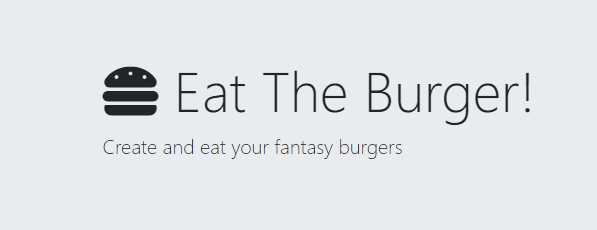

# Eat The Burger! 
***
   

### Table of Contents
* [Description](#Description)
* [Installation](#Installation)
* [Usage](#Usage)
* [License](#License)
* [Contribution](#Contribution)
* [Questions](#Questions)
---
   
### Description 
This is a full-stack application using node.js, mySQL, Express, and Handlebars in which you can eat the burgers of your dreams!
   
---
   
### Installation 
For installing this project, you must first download the repo, then run schema.sql in your preferred mySQL GUI. If you would like sample data in your database, run the seeds.sql file as well. Next install all node dependencies using the command npm i. After that, run server.js with node and visit the page!
   
---
   
### Usage 
This project is all about burgers. You can add burgers to the database using the textbox and submit button at the bottom of the page. Once added, burgers will have a devour button that, when clicked, will move the burger from the uneaten column to the devoured column. 
   
---
   
### License 
This project is covered under the MIT license

---
   
### Contribution 
If you would like to contribute to the project please submit pull requests for review.
   
---
   
   
### Questions 

[brendonstahl97](https://github.com/brendonstahl97)

brendonstahl97@gmail.com
   
---